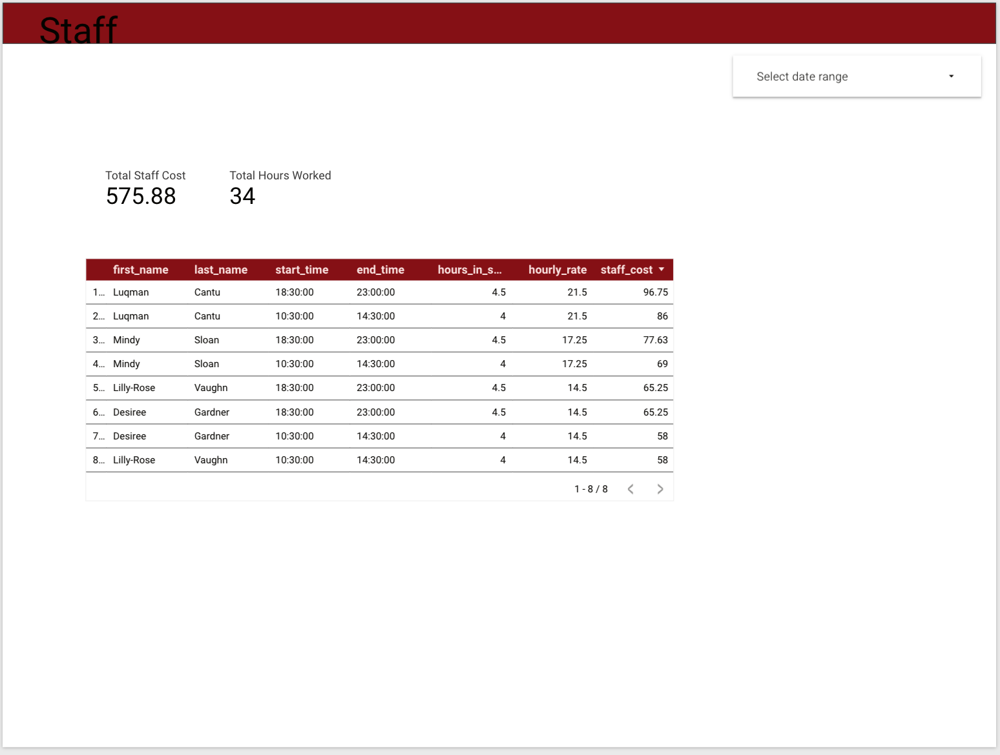
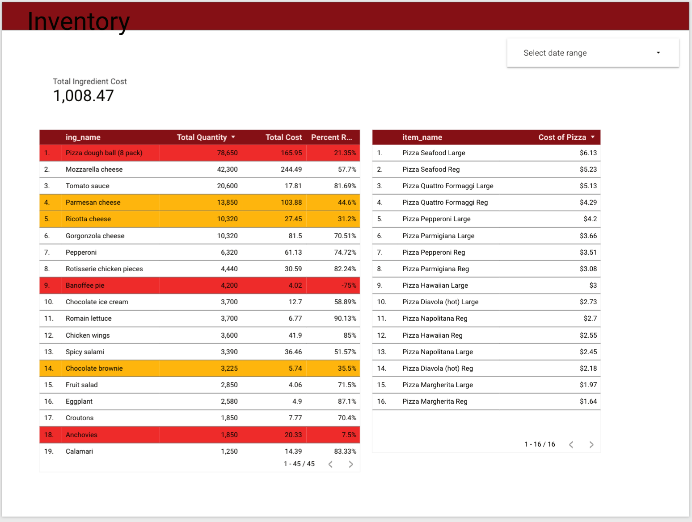
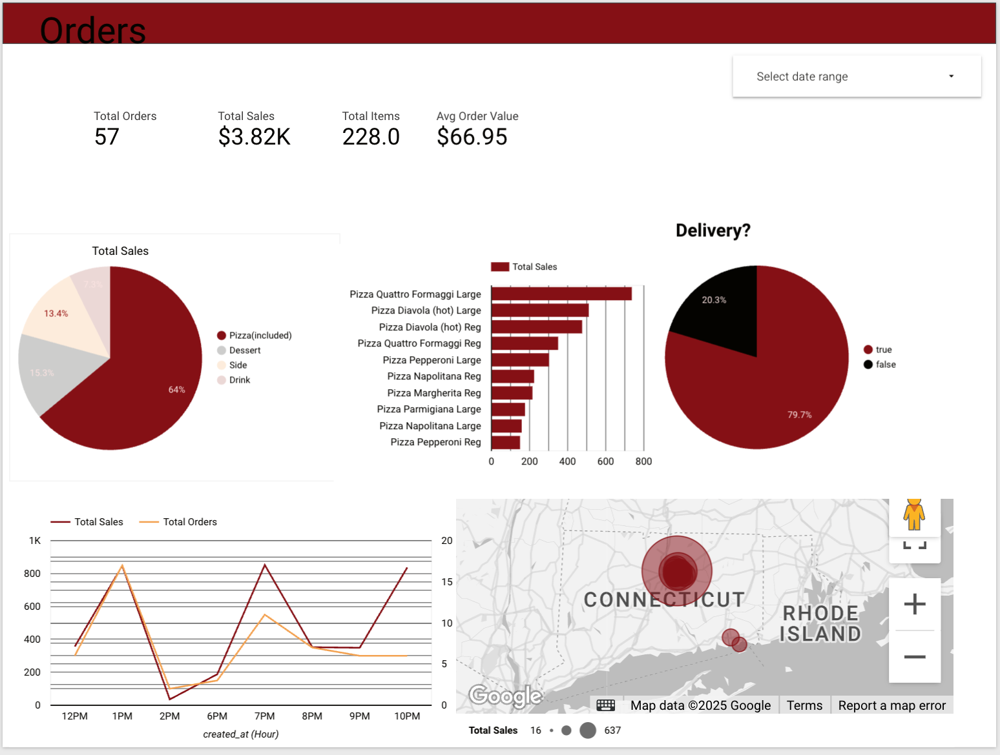

# 🍕 Pizza Inventory Analytics — SQL + Looker Studio + Google Cloud

This project analyzes pizza inventory, sales performance, and ingredient usage using SQL and cloud-based analytics tools.
It includes database design, data modeling, SQL queries, and an interactive dashboard built in Looker Studio.

---
# ⭐ Project Overview
The goal of this project is to track pizza sales, understand inventory usage, and identify trends using a fully cloud-based setup:

1. Google Cloud SQL hosts the relational database

2. Navicat Premium is used to manage and query the SQL database

3. Google Cloud Storage stores the CSV data

4. Looker Studio is used to create a dynamic analytics dashboard

---
# 🧰 Tools & Technologies
SQL (MySQL dialect)

Google Cloud SQL

Google Cloud Storage (GCS)

Navicat Premium

Looker Studio (for dashboard & reporting)

ERD / schema design

---
# 📊 Dashboard Insights (Looker Studio)
Includes visualizations for:

Total sales & revenue

Top-selling pizza categories

Inventory usage by ingredient

Daily & monthly sales trends

Order volume peak hours

Cost vs. waste analysis

---
# 🗄️ Database Design
Normalized tables for orders, pizzas, ingredients, and inventory

Primary/foreign key relationships

All SQL scripts included for recreation

Queries optimized for Looker Studio reporting

---
# How the Project Works
Upload CSV files to Google Cloud Storage

Import data into Cloud SQL using Navicat Premium

Run SQL scripts to clean and model the data

Connect Cloud SQL to Looker Studio

Build dashboard visualizations

---
## 📊 Looker Studio Dashboards

This project includes interactive analytics dashboards built with **Google Looker Studio**, connected to my MySQL database (Navicat Premium + Google Cloud).

### 🔗 Dashboard Access
If you want to view the interactive version:  
👉 **Looker Studio Dashboard:** [https://lookerstudio.google.com/s/gv5lcQP7-60]

---

### 🧾 Staff Dashboard
Shows total staff cost, hours worked, and individual shift breakdown.

---

### 🧾 Inventory Dashboard
Displays ingredient usage, ordering cost, percent contribution, and cost per pizza.

---

### 🧾 Orders Dashboard
Includes sales metrics, delivery % breakdown, top-selling pizzas, and hourly performance.

## License
This project is licensed under the [MIT License](LICENSE).- You are free to use, modify, and share this project with proper attribution.

## About Me
Hi there! I'm **Winnie Happi**, a **graduate student** in Data Science and an aspiring data professional eager to grow my career by applying analytical skills to real-world challenges. 
Connect with me on LinkedIn

